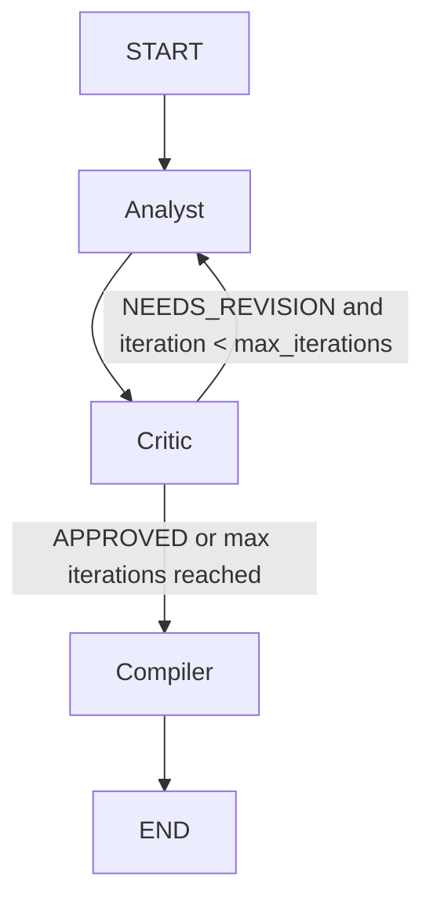

# Market Analyst Multi-Agent System

## Overview

This project is a multi-agent market research system built for the topic **EV market in Europe 2025**.

The system follows the **Evaluator-Optimizer** pattern:

- **Research Analyst** gathers evidence from trusted web sources and a local RAG knowledge base, then produces a structured draft report.
- **Critic** reviews the draft, identifies weak evidence, unsupported claims, missing perspectives, and decides whether revision is needed.
- **Compiler** converts the best available draft into a final structured report and saves it as a Markdown artifact.

The workflow is implemented with **LangGraph**, monitored with **Langfuse**, and evaluated with **LLM-as-a-Judge** tests via **DeepEval**.

---

## Project Goal

The goal of the project is to generate a structured market research report for the **European EV market in 2025**, combining:

- local RAG-based retrieval from a curated document corpus,
- trusted web search,
- iterative quality control through a Critic agent,
- and final report compilation into a saved Markdown deliverable.

---

## Architecture

### Agent roles

**1. Research Analyst**
- Input: topic, scope, focus areas, optional critic feedback
- Tools:
  - trusted web search
  - local RAG knowledge search
- Output:
  - `DraftReport`

**2. Critic**
- Input:
  - `DraftReport`
- Tools:
  - trusted web verification
  - structured output
- Output:
  - `CriticFeedback`

**3. Compiler**
- Input:
  - approved or best-available `DraftReport`
- Tools:
  - structured output
  - file save tool
- Output:
  - `FinalReport`
  - saved `.md` report

---

## Workflow

The pipeline is implemented as a **LangGraph StateGraph**:



### Routing logic

- `START -> Analyst`
- `Analyst -> Critic`
- if `CriticFeedback.verdict == NEEDS_REVISION` and iteration < `max_iterations`
  - return to `Analyst`
- otherwise
  - go to `Compiler`
- `Compiler -> END`

The system uses a maximum number of revision rounds to avoid infinite loops.

---

## Structured Output Schemas

### `DraftReport`
- `executive_summary: str`
- `findings: list[Finding]`
- `sources: list[str]`
- `data_points: list[str]`

### `CriticFeedback`
- `verdict: Literal["APPROVED", "NEEDS_REVISION"]`
- `issues: list[str]`
- `missing_perspectives: list[str]`
- `fact_check_results: list[str]`
- `score: float`

### `FinalReport`
- `executive_summary: str`
- `key_findings: list[str]`
- `recommendations: list[str]`
- `sources: list[str]`
- `methodology: str`

---

## Data Collection for RAG

The RAG corpus was prepared for the topic **EV market in Europe 2025**.

The corpus includes:
- web articles saved as `.md/.txt`
- PDF reports
- Wikipedia pages saved as text

Example source groups used in the project:
- IEA
- ICCT
- ACEA
- EAFO
- European Commission
- Deloitte
- Transport & Environment
- New AutoMotive / E-Mobility Europe

### Data directory layout

```text
data/raw_docs/
  pdf/
  articles/
  wiki/
```

### Indexing

The ingestion step:
- loads documents from the local corpus,
- chunks them,
- builds embeddings,
- creates a FAISS index,
- stores chunks and ingestion metadata.

---

## Project Structure

```text
fpr/
  agents/
    __init__.py
    analyst.py
    critic.py
    compiler.py
  data/
    raw_docs/
      pdf/
      articles/
      wiki/
  index/
    faiss_index/
    chunks.pkl
    ingest_manifest.json
  output/
  screenshots/
  tests/
    conftest.py
    _helpers.py
    test_analyst.py
    test_critic.py
    test_compiler.py
    test_e2e.py
  schemas.py
  config.py
  tools.py
  retriever.py
  ingest.py
  graph.py
  langfuse_utils.py
  main.py
  README.md
```

---

## Installation

Create and activate your environment, then install dependencies:

```bash
pip install -r requirements.txt
```

If you do not use `requirements.txt` yet, install the main packages manually:

```bash
pip install langgraph langchain langchain-openai langchain-community faiss-cpu pydantic pydantic-settings ddgs deepeval python-dotenv pypdf trafilatura beautifulsoup4 requests pytest
```

---

## Environment Variables

Create a `.env` file in the project root:

```env
OPENAI_API_KEY=...
LANGFUSE_PUBLIC_KEY=pk-lf-...
LANGFUSE_SECRET_KEY=sk-lf-...
LANGFUSE_BASE_URL=https://cloud.langfuse.com
```

---

## Build the RAG Index

After collecting documents into `data/raw_docs/`, run:

```bash
python ingest.py
```

This creates:
- FAISS index
- chunk store
- ingestion manifest

---

## Run the Project

```bash
python main.py
```

Example input:

**Topic**
```text
EV market in Europe 2025
```

**Scope**
```text
Passenger EV adoption, charging infrastructure, regulation, competition, risks and outlook
```

### Output
The system produces:
- iterative Analyst ↔ Critic loop
- final structured report
- saved Markdown artifact in `output/`
- Langfuse trace with session tracking

---

## Observability with Langfuse

The entire pipeline is monitored with **Langfuse**.

Tracked elements include:
- root pipeline run
- analyst node
- critic node
- compiler node
- session ID
- user ID
- iteration number
- nested model calls via LangChain callback handler

This makes the revision loop observable instead of a black box.

---

## Evaluation

The project includes **LLM-as-a-Judge** tests implemented with **DeepEval**.

### Test files
- `tests/test_analyst.py`
- `tests/test_critic.py`
- `tests/test_compiler.py`
- `tests/test_e2e.py`

### Run all tests

```bash
deepeval test run tests/
```

### Current local result
- 4 tests passed
- 100% pass rate

Covered evaluation areas:
- **Analyst**: evidence-backed and specific draft generation
- **Critic**: ability to detect real weaknesses and missing perspectives
- **Compiler**: preservation of structure and meaning
- **End-to-end**: final report relevance and balance

---
### Screenshots
-added screenshots of **Langfuse**
-added recording of launching main.py, langfuse and tests run and result of their running

## Example Final Output

The final saved report contains:
- executive summary
- key findings
- recommendations
- sources
- methodology
- unresolved critic issues if the draft is compiled without full approval

---
